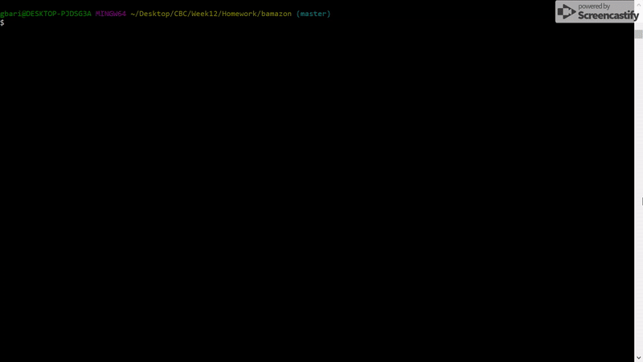
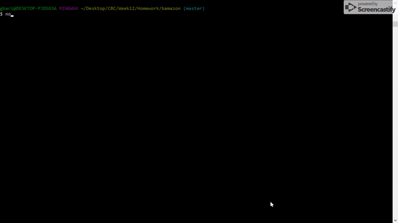

This project was the homework for week 12 of the Penn Coding Boot Camp.

## Goal
To create an amazon-like store with three levels of access.

## Installation and Set-up
Make sure to run *npm install* at the root directory after cloning the project. You will also need to run (using either Workbench or from the command line) the sql file `bamazonDB.sql` in order to create the database.
You also need to create a file named `keys.js` in the root directory, which includes an object that holds the host, port, user, password and database, for the database that you created using the `bamazonDB.sql` file.

```
var keys = {
    host: "[YOUR_HOST_NAME]",
    port: [YOUR_PORT_NUMBER],
    user: "[YOUR_USER]",
    password: "[YOUR_PASSWORD]",
    database: "bamazonDB"
}

module.exports.keys = keys;
```

## Functionality
This application consists of 3 commands:

| Command              |  Action                                                            |  npm run _____        |
| ---------------------|--------------------------------------------------------------------|-----------------------|
| bamazonCustomer.js   |  The user can buy a product                                        |  customer             |
| bamazonManager.js    |  The user can view products for sale, view low inventory, add/remove inventory and add new products  |  manager |
| bamazonSupervisor.js |  The user can view product sales by department and create a new department |  supervisor   |





Please see the videos in the `assets` folder for a demo of the `supervisor` program.

## Objectives
* To create a database using MySQL.
* To use NodeJS to interact with that database, manipulate its data and display it back to the user.

## Built using:
* JavaScript
* NodeJS
* MySQL

## Authors
**Guillermo Barila** - *Author* -->